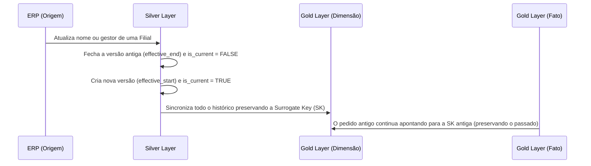

# 📦 LogiFlow Analytics: Plataforma Logística End-to-End

Bem-vindo ao **LogiFlow Analytics**, um case completo de **Analytics Engineering e Data Engineering End-to-End** focado no desenvolvimento de uma arquitetura escalável utilizando o **Databricks** como tecnologia central.

Este projeto tem como objetivo demonstrar, na prática, como construir pipelines de dados, modelar informações e entregar resultados reais para o negócio. Toda a solução foi estruturada para resolver os desafios do dia a dia de uma operação corporativa de verdade.

---

## 🏭 O Contexto e Problema de Negócio

Em grandes operações de Supply Chain focadas no **varejo B2B/B2C de papelaria e materiais de escritório**, a alta fragmentação de itens (como cadernos, resmas e canetas) torna o fluxo logístico interno um grande desafio. O cenário aqui simulado é criar uma plataforma para medir o desempenho de uma rede de distribuição nacional focada nesse segmento. O foco é acompanhar o **Tempo de Separação (SLA)** dos pedidos, a produtividade dos operadores, o backlog e os motivos de atrasos (ocorrências).

Para criar esse cenário de forma realista, o script `gerar_dados_fake` atua como um sistema ERP. Ele simula o volume e a estrutura de tabelas de um ambiente **SAP Business One (HANA DB)** distribuindo milhares de itens de escritório. Os dados gerados são fictícios, mas respeitam todas as regras de negócio e dependências de uma operação real.

---

## 🏗️ Arquitetura e Fluxo de Dados (Lakehouse)

A solução foi projetada no paradigma **Lakehouse**, seguindo a arquitetura Medallion.

---

## ⚙️ 1. Engenharia de Dados e Databricks

Toda a transformação acontece no **Databricks**, aproveitando as vantagens do formato **Delta Lake**:

- **Jobs e Workflows**: O processo ponta a ponta é orquestrado de forma automática e rastreável pelo Databricks Workflows, com dependências claras e políticas de retentativa (retry) contra falhas.
- **Versionamento (GitHub)**: O projeto emprega boas práticas de colaboração, com código rastreado e integrado (CI/CD) usando o Databricks Repos.
- **Bronze**: Recebe os dados brutos imutáveis, atuando como o histórico completo e fiel do sistema de origem.
- **Silver**: Realiza limpeza, organização e remoção de duplicidades. Para o cruzamento de Picklists (`OPKL`), o hash de controle (idempotência) varre até mesmo os timestamps de cada fase operacional e usuário associado, garantindo que qualquer correção no passado reflita instantaneamente no Lakehouse.

---

## ⏳ 2. Preservação de Histórico (SCD Type 2)

Saber o estado de uma dimensão no passado é fundamental. O projeto utiliza **Slowly Changing Dimensions (SCD Tipo 2)** nas dimensões (ex: clientes e filiais). 

Quando a origem emite um `UpdateDate` ou o hash de atributos de uma entidade muda, o comando `MERGE` preserva o histórico usando colunas de controle. 

---

## 📐 3. Modelagem de Dados (Star Schema)

A camada Gold é o coração do projeto. Ela foi modelada no formato **Star Schema**, pensada para acelerar consultas e entregar confiabilidade:

- **Fatos e Dimensões**: Separa as transações (`fact_picklists`) das características do negócio (`dim_produto`, `dim_empresas`, `dim_cliente`, `dim_data`).
- **Granularidade e Nulls**: Definição clara de que cada linha da Fato é um *picklist*. Pedidos ainda não separados possuem SLA `Nulo` (evitando distorcer médias com falsos `0`).
- **Surrogate Keys (SKs)**: A Fato rastreia exatamente qual versão da filial ou cliente era válida *na data daquele pedido*, cruzando datas de efetividade (SCD2) e armazenando apenas a SK definitiva, blindando o BI.

---

## 📈 4. Servindo os Dados e Analytics

A engenharia e a modelagem servem a um único propósito: transformar o dado em informação útil. A camada de consumo (Serving Layer) é viabilizada pelo **Databricks SQL Warehouse**, provendo computação otimizada, governança avançada e alta performance para consultas externas.

A ponta final da arquitetura é o **Power BI** (conectado via DirectQuery/Import), que consome as tabelas Gold seguras e foca apenas em mostrar o que importa:
- Acompanhamento preciso do **Tempo de Separação** e quebra de **SLA**.
- Comparação clara do **Desempenho por Filial** e produtividade da equipe.
- Motivos das **Ocorrências** que paralisam a operação (infraestrutura, sistemas, RH).

---

## 🛡️ 5. Governança e Qualidade de Dados (Testes)

Para garantir resiliência e confiança, o projeto simula um ambiente de governança robusto, utilizando a estrutura de **Databricks SQL Alerts**. Na pasta `tests/sql/alerts/`, encontram-se testes arquiteturais que monitoram diariamente a saúde do Lakehouse:

- **Validação de SCD Type 2**: Testes (`silver.dim_cliente_scd` e `silver.dim_empresas`) que garantem que não há quebra temporal no histórico: monitora chaves ativas simultaneamente (`is_current` duplicado), sobreposição de datas de validade (`effective_start` > `effective_end`), ou buracos no histórico.
- **Deduplicação e Idempotência**: Teste na tabela `silver.opkl_clean` que dispara alertas caso uma transação de Picklist apareça em duplicidade, ou caso falte o `row_hash` de auditoria.
- **Integridade da Fato**: O teste `gold.fact_picklists` previne que SLAs fiquem negativos ou que a Fato deixe de mapear adequadamente a Surrogate Key da Dimensão (gerando NULLs que quebram o cruzamento no Power BI).

---

## 🚀 Como Executar e Evoluções Futuras

1. **Geração dos Dados**: Execute `gerar_dados_fake/scripts/main.py` para gerar os CSVs. (O script possui parametrizações robustas de volumetria).
2. **Databricks Workflows**: Importe o arquivo YAML contido em `jobs/` para estruturar a DAG no seu Databricks Workspace.
3. **Run**: Inicie o Job. Ele executará sequencialmente as tabelas Bronze, em seguida a modelagem na Silver (com SCD2), finalizando na Gold.

**Evoluções Futuras (Roadmap)**:
- Ativar o modo *Incremental* no gerador de dados (atualmente implementado via configuração, pronto para ser exposto).
- Congelar *seeds* no script de geração de dados para testes A/B reprodutíveis.

---

## 💻 Stack Tecnológico

- **Processamento & Orquestração**: Databricks (Workflows/Jobs), Spark SQL.
- **Serving Layer (Consumo)**: Databricks SQL Warehouse.
- **Armazenamento (Storage)**: Delta Lake.
- **Simulação de Dados**: Python.
- **Visualização (BI)**: Power BI.

---

## 📁 Estrutura do Repositório

- `assets/`: Imagens e recursos visuais utilizados na documentação.
- `gerar_dados_fake/`: Simulador construído em Python que gera massas de dados sintéticos simulando o ERP SAP B1 e automatiza a criação do catálogo no Databricks.
- `jobs/`: Arquivo YAML do Databricks Workflows, organizando a DAG com a ordem e as dependências de cada tarefa, incluindo testes e retries.
- `models/`: Scripts SQL com as regras de negócio de extração, limpeza (ETL) e modelagem dimensional nas camadas Bronze, Silver e Gold.
- `tests/sql/alerts/`: Testes automatizados em JSON utilizados nos Databricks SQL Alerts para monitoramento contínuo de Governança e Qualidade de Dados.

> *"Este projeto demonstra como unir a construção técnica no Databricks, a modelagem correta e a visão de negócio para entregar respostas rápidas e confiáveis."*
